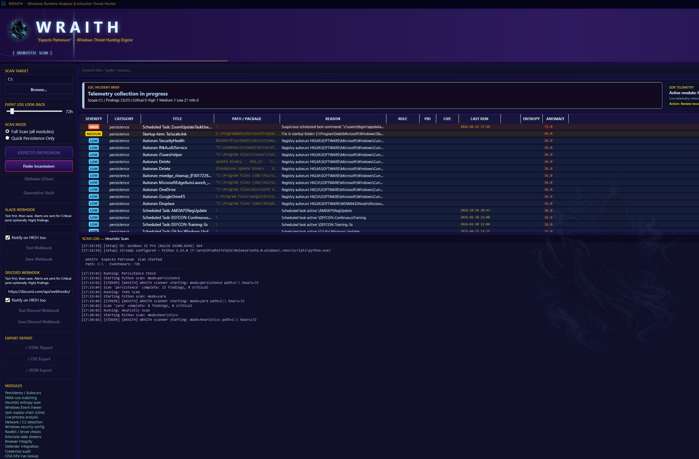
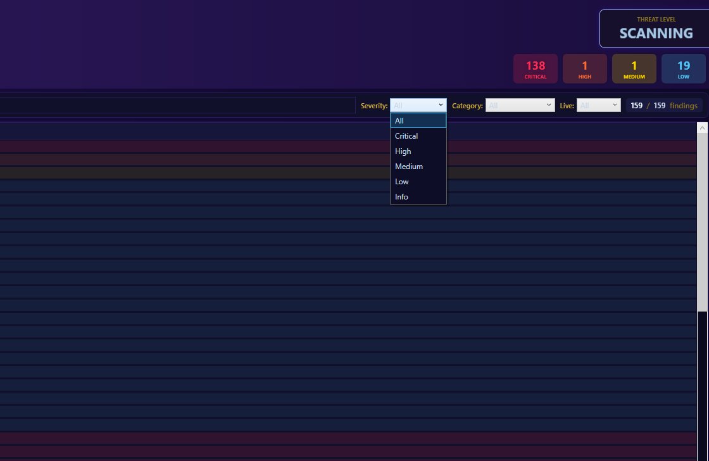
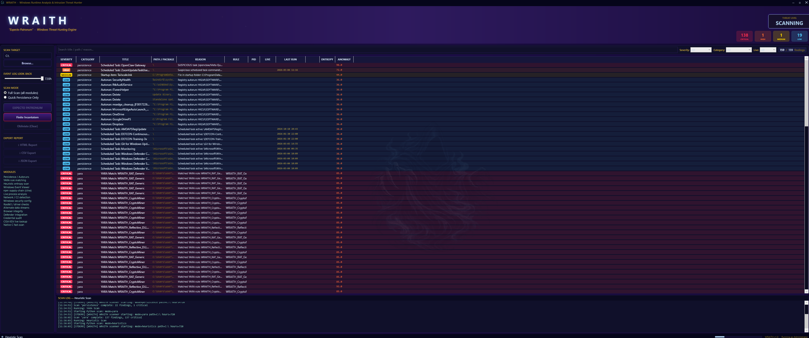
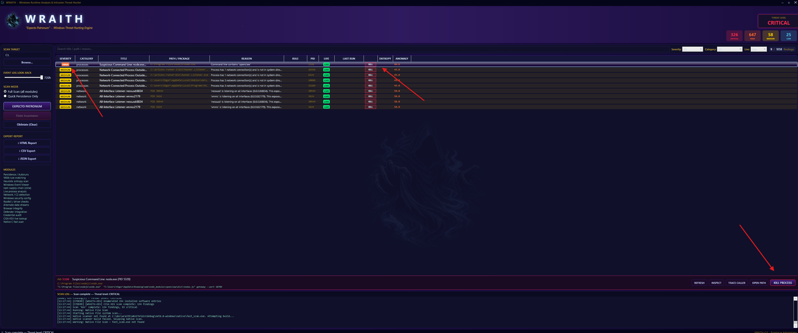

<div align="center">


<pre align="center">
 ██╗    ██╗██████╗  █████╗ ██╗████████╗██╗  ██╗
 ██║    ██║██╔══██╗██╔══██╗██║╚══██╔══╝██║  ██║
 ██║ █╗ ██║██████╔╝███████║██║   ██║   ███████║
 ██║███╗██║██╔══██╗██╔══██║██║   ██║   ██╔══██║
 ╚███╔███╔╝██║  ██║██║  ██║██║   ██║   ██║  ██║
  ╚══╝╚══╝ ╚═╝  ╚═╝╚═╝  ╚═╝╚═╝   ╚═╝   ╚═╝  ╚═╝
</pre>

**Windows Runtime Analysis & Intrusion Threat Hunter**
**With a**  **and OpenSource data retrieval system** · *Expecto Patronum*

[](https://github.com/OpenSource-For-Freedom/wraith/actions/workflows/deploy.yml)
[](docs/windows10.md)
[](https://dotnet.microsoft.com/download/dotnet/8.0)
[](https://python.org/downloads/)
[](LICENSE)

A native Windows threat-hunting application that orchestrates 14 scan modules across YARA, behavioral heuristics, persistence mechanisms, supply-chain checks, and live process analysis — all surfaced through a dark-themed WPF dashboard.
This tools stands eith **Defender** and can supply **Sentinal** true event alerts and sources found through the OpenSource pipeline. 
</div>


<a href="https://hits.dwyl.com/OpenSource-For-Freedom/WRAITH">
  

## Installation
- Install from [release](https://github.com/OpenSource-For-Freedom/wraith/releases) packaged source.

---

## Documentation

| Guide | Description |
|---|---|
| [Windows 10 Setup](docs/windows10.md) | Win10 build compatibility, winget fallback, audit policy, known limitations |
| [Scan Modules](#scan-modules) | What each of the 14 modules hunts |
| [Usage](#usage) | GUI, headless, and scripted usage |
| [Output](#output) | Report formats and severity tiers |

### Library & Framework References

| Library | Purpose | Docs |
|---|---|---|
| .NET 8 WPF | GUI framework | [docs.microsoft.com/wpf](https://docs.microsoft.com/en-us/dotnet/desktop/wpf/) |
| YARA 4.x | Signature engine | [virustotal.github.io/yara](https://virustotal.github.io/yara/) |
| yara-python | Python YARA bindings | [pypi: yara-python](https://pypi.org/project/yara-python/) |
| pywin32 | Win32 API access | [pypi: pywin32](https://pypi.org/project/pywin32/) |
| psutil | Process & network info | [psutil.readthedocs.io](https://psutil.readthedocs.io/) |
| requests | CISA KEV API | [docs.python-requests.org](https://docs.python-requests.org/) |
| python-magic | File entropy & MIME | [pypi: python-magic](https://pypi.org/project/python-magic/) |
| CIM / WMI | Service & process enumeration | [Win32 Provider](https://docs.microsoft.com/en-us/windows/win32/cimwin32prov/win32-provider) |
| Windows Event Log | Event parsing | [Get-WinEvent](https://docs.microsoft.com/en-us/powershell/module/microsoft.powershell.diagnostics/get-winevent) |
| CISA KEV | Known Exploited Vulnerabilities | [cisa.gov/kev](https://www.cisa.gov/known-exploited-vulnerabilities-catalog) |

---


## UI Walkthrough

<p align="center">
  
</p>

### Live scan in action
<p align="center">
  
</p>

Findings surface in real time as each of the 14 modules runs — YARA matches, heuristic hits, persistence entries, and process anomalies all stream into the same feed ranked by severity.

---

### Dashboard — live threat feed
<p align="center">
  
</p>

Findings stream in as each module completes. Every row shows severity, module, finding name, path/process, and entropy score. Click any row to expand details. Use the toolbar to **kill a live process**, **export the report**, or **clear the list**.

---

### Severity filter & scan controls
<p align="center">
  
</p>

Filter the feed by severity (CRITICAL → INFO) in real time without re-running the scan. Scan-root, look-back window, and scan mode are all set before clicking **EXPECTO PATRONUM**.

---

### Full results view
<p align="center">
  
</p>

After the scan completes the summary bar shows total counts per severity tier. Export to **JSON**, **CSV**, or a self-contained **HTML** report from the toolbar at any time.

---

### Killing a live process
<p align="center">
  
</p>

Select any finding tied to a running process, then hit **Kill Process** in the toolbar. WRAITH confirms the target PID and name before terminating — no silent kills. The row updates immediately to reflect the process is gone.

---

## Requirements

| Dependency | Minimum | Notes |
|---|---|---|
| Windows | 10 21H1 / 11 | x64 — [Win10 guide](docs/windows10.md) |
| .NET SDK | 8.0 | [Download](https://dotnet.microsoft.com/download/dotnet/8.0) — only needed to build from source |
| Python | 3.10+ | [Download](https://python.org/downloads/) — check **Add to PATH** |
| Administrator | Required | UAC prompt on launch |

---

## Quick Start for Development 

```bat
git clone https://github.com/YOUR_USERNAME/wraith.git
cd wraith
LAUNCH.bat
```

`LAUNCH.bat` will on first run:
1. Create a Python virtual environment (`.venv/`)
2. Install all Python dependencies
3. Build the .NET 8 WPF app (Release)
4. Create a desktop shortcut
5. Launch WRAITH

---

## Scan Modules

| Module | What it hunts |
|---|---|
| **YARA** | Signature matches — APT28/Sofacy, Lazarus, GrizzlyBear, WannaCry, RATs, webshells, malicious scripts |
| **Heuristics** | Behavioural entropy analysis, obfuscated commands, suspicious parent-child process trees |
| **Persistence** | Registry Run keys, scheduled tasks, startup folders, services, WMI subscriptions |
| **Processes** | Injected threads, hollowed images, unbacked memory, unsigned binaries in unusual paths |
| **Network** | Outbound connections to suspicious ranges, listening ports, unusual DNS activity |
| **Events** | Windows Event Log anomaly parsing (configurable look-back window, 1–720 h) |
| **CISA KEV** | Live check of CISA's Known Exploited Vulnerabilities catalogue against installed software |
| **NPM Supply Chain** | Typosquat and dependency-confusion checks across local npm projects |
| **Windows Security** | Firewall state, Defender status, audit policy gaps, UAC configuration |
| **Rootkit** | SSDT / IDT hooks, hidden drivers, DKOM object unlinking indicators |
| **ADS** | Alternate Data Streams on NTFS — a classic hiding place for payloads |
| **Browser** | Suspicious extensions, modified hosts file, malicious bookmark indicators |
| **Defender** | Integration layer — surfaces quarantined items and threat history |
| **Credentials** | SAM / LSA / DPAPI anomalies, plain-text credential indicators in memory |

---

## Usage

### GUI (recommended)
```bat
LAUNCH.bat
```
- Set scan root (default `C:\`)
- Choose **Full Scan** or **Quick Persistence Only**
- Set Event Log look-back window (hours)
- Click **EXPECTO PATRONUM**
- Export findings as JSON / CSV / HTML from the toolbar

### Headless quick scan (no build required)
```powershell
.\quick-scan.ps1
.\quick-scan.ps1 -Hours 168 -OutPath C:\wraith-report.json
```

### Stop a running instance
```bat
LAUNCH.bat -Close
```

---

## Output

Findings are rated **CRITICAL / HIGH / MEDIUM / LOW / INFO** and include:

- Rule / heuristic name that triggered
- Full file path or process image
- Entropy score (for binary analysis)
- Process status (live / terminated)
- Last-run timestamp
- One-click process kill for live threats

Reports can be exported to **JSON**, **CSV**, or a self-contained **HTML** page.

---

## Project Structure

```
WRAITH/                  .NET 8 WPF front-end
  Models/                ThreatFinding, ScanResult
  ViewModels/            MainViewModel (MVVM)
  Services/              ScanOrchestrator, ReportExporter
  Converters/            Severity -> colour, etc.
scanner/                 Python scan engine (14 modules)
  rules/                 Bundled YARA rule sets
quick-scan.ps1           Standalone headless scanner (no build needed)
WRAITH.ps1               Master launcher / venv bootstrap
LAUNCH.bat               Entry point
SETUP.bat                One-time dependency installer
```

---

## License

MIT — see [LICENSE](LICENSE)
